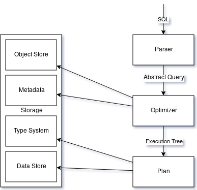

Übersicht
=========

Das System wird in zwei Teile, bestehend aus jeweils mehreren Komponenten aufgeteilt:
Ein System bildet der Storage, über den sämtliche Datenoperationen abgebildet werden.
Der andere Teil ist die Ausführungseinheit, welche von einem SQL Query ausgehend diesen parsed,
einen Plan aus diesem generiert und diesen auch ausführt.

Storage
-------

Der Storage lässt sich in vier Teilkomponenten untergliedern.
Auf unterster Ebene liegt der Data Store, welche über Tabellen Operationen
zum Hinzufügen, Löschen und Durchsuchen der Daten bieten.

Darüber liegt das Typensystem, welches es ermöglicht, durch die Zuordnung von
Typen zu Daten bestimmte Operationen, wie Vergleiche oder Konversionen durchzuführen.

Die Informationen der Tabellenstruktur wird in den Metadaten gespeichert.
Der Object Store ermöglicht auf oberster Schicht das Durchsuchen der Metadaten
und den Zugriff auf die Tabellen.

Ausführung
----------

Die Ausführung besteht aus drei Teilkomponenten, welche eine SQL Abfrage
nacheinander durchläuft. Zuerst wird die Anfrage vom Parser in einen Abstrakten
Query umgewandelt. Diese enthält sämtliche Informationen des Queries, bereinigt
von der texutellen Darstellung.

Mit diesen Informationen versucht der Optimizer
einen Plan für tatsächlich Zugriff auf die Daten zu generieren. Dieser Plan
besteht aus einem Baum mehrerer Nodes. Dadurch werden komplexe Abfragen durch
einfachere Abfragen abgebildet. Um diesen Plan optimal zu generieren, verwendet
der Optimizer die Tabellenstruktur, welche im Object Store in Form der Metadaten
hinterlegt sind.

Der Plan besteht aus einzelnen Nodes, welche solange Daten liefern, bis von
den untergeordneten Nodes keine Daten mehr liefern, oder im Falle der Leaf-Nodes
keine weiteren Zeilen in der Tabelle gefunden werden können, welche die gegebene
Bedingung erfüllen.
